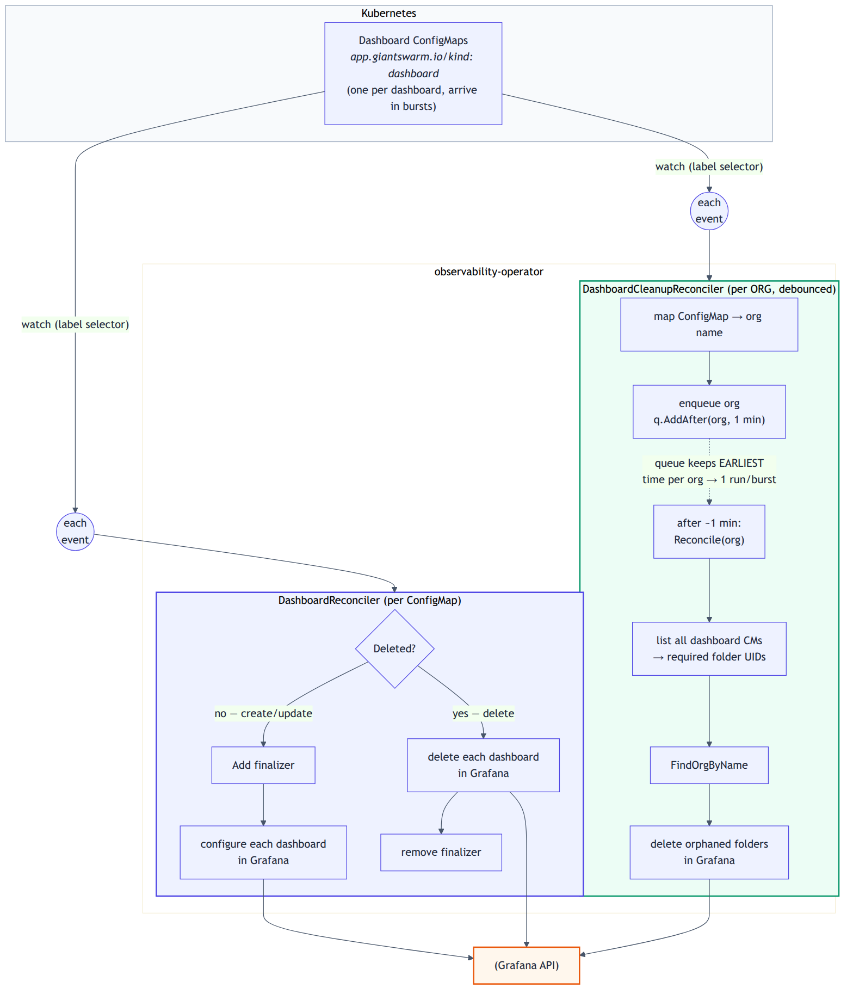

# Dashboard Controllers Architecture

Two controllers provision Grafana dashboards from labeled Kubernetes `ConfigMaps`:

| Controller | Name | Responsibility |
|---|---|---|
| `DashboardReconciler` | `dashboard` | Create, update, and delete dashboards in Grafana, and ensure their folder hierarchy exists. |
| `DashboardCleanupReconciler` | `dashboard-cleanup` | Delete operator-managed folders that no longer hold any dashboard, once per organization. |

## Source of truth

Each dashboard `ConfigMap` carries the desired state. Both controllers select ConfigMaps with the label `app.giantswarm.io/kind: dashboard` and read the target organization and folder from labels or annotations:

- `observability.giantswarm.io/organization: <org-name>` — required.
- `observability.giantswarm.io/folder: <path>` — optional, slash-separated nested path.

`mapper.DashboardMapper.FromConfigMap` converts a ConfigMap into one `dashboard.Dashboard` domain object per entry in `.data`, attaching the extracted organization and folder path to each.

Folder UIDs are deterministic: `folder.GenerateUID` hashes the full path (SHA-256, first 6 bytes) and prefixes it with `gs-`. A folder whose UID carries the `gs-` prefix is operator-managed. The UID depends only on the path, so the same path always maps to the same folder.

## Dashboard controller

### Watches

`DashboardReconciler.SetupWithManager` configures two event sources:

- `ConfigMap` objects filtered by the dashboard label selector.
- `Pod` objects filtered to the Grafana instance, gated by `predicates.GrafanaPodRecreatedPredicate`. When the Grafana pod is recreated, every dashboard ConfigMap is enqueued so all dashboards re-provision against the fresh Grafana.

### Reconcile

For each ConfigMap event:

1. Get the ConfigMap. A `NotFound` returns cleanly.
2. Generate a Grafana client and wrap it in a `grafana.Service`.
3. Branch on the deletion timestamp:
   - Zero → `reconcileCreate`.
   - Non-zero → `reconcileDelete`.

**`reconcileCreate`** adds the finalizer `observability.giantswarm.io/grafanadashboard` before any mutation and returns early after adding it. It then calls `ConfigureDashboard` for every dashboard parsed from the ConfigMap.

**`reconcileDelete`** returns immediately if the finalizer is absent. Otherwise it calls `DeleteDashboard` for every dashboard, then removes the finalizer last.

Both branches route through `processDashboards`, which iterates the parsed dashboards, runs domain validation on each, applies the supplied operation, and joins per-dashboard errors with `errors.Join`. Folder cleanup is not performed in this controller.

### Grafana operations

`grafana.Service` scopes every call to the target organization via `withinOrganization`, which clones the Grafana client with the org ID.

- `ConfigureDashboard` ensures the folder hierarchy exists (`ensureFolderHierarchy`), strips the `id` field, injects the `managed-by: observability-operator` tag at the schema-appropriate location, and publishes the dashboard with `Overwrite: true`.
- `ensureFolderHierarchy` walks the path segment by segment: it creates each missing folder with its deterministic UID and parent UID, and renames any folder whose title drifted from the path. It caches the resolved leaf UID per `(orgID, path)`.
- `DeleteDashboard` deletes the dashboard by UID and treats a `NotFound` response as success.

## Dashboard cleanup controller

This controller is keyed by organization name rather than by ConfigMap. The organization is carried in the reconcile request `Name`, so cleanup runs once per organization.

### Watches and debouncing

`DashboardCleanupReconciler.SetupWithManager` watches dashboard `ConfigMaps` (same label selector) through a custom `handler.Funcs`. On create, update, or delete:

1. `organizationRequest` extracts the organization from the changed ConfigMap. The event is dropped if the object is not a ConfigMap or carries no organization.
2. A reconcile request is built whose `Name` is the organization.
3. It is enqueued with `q.AddAfter(req, cleanupDelay)`, where `cleanupDelay` is **one minute**.

The delaying workqueue keeps the earliest scheduled time per key. A burst of dashboard events for one organization collapses into a single cleanup that runs roughly one minute after the first event of the burst. Cleanup is eventually consistent: orphaned folders disappear up to about a minute after the last dashboard referencing them is removed.

### Reconcile

For an organization name:

1. Generate a Grafana client and `grafana.Service`.
2. Resolve the organization by name (`FindOrgByName`).
3. Compute the set of folder UIDs still required (`collectRequiredFolderUIDs`): list all dashboard ConfigMaps, filter to those targeting this organization, and collect the UID of every segment of each folder path.
4. Delete the orphans via `CleanupOrphanedFoldersForOrg`.

`CleanupOrphanedFoldersForOrg` scopes to the organization, lists all folders, and sorts them deepest-first by depth derived from the `ParentUID` chain (`folderDepths`), so leaves are processed before parents. For each folder, it deletes the folder only when all three hold:

- The UID is operator-managed (`gs-` prefix).
- It is not in the required-UID set.
- It is empty (`GetFolderDescendantCounts` reports zero descendants).

Non-empty orphans are skipped with an info log. Per-folder errors are collected with `errors.Join`.

## Failure isolation

Dashboard provisioning and folder cleanup are independent reconcile loops with independent error handling. A cleanup failure does not fail dashboard reconciliation, and a single dashboard or folder error does not abort processing of the rest.
