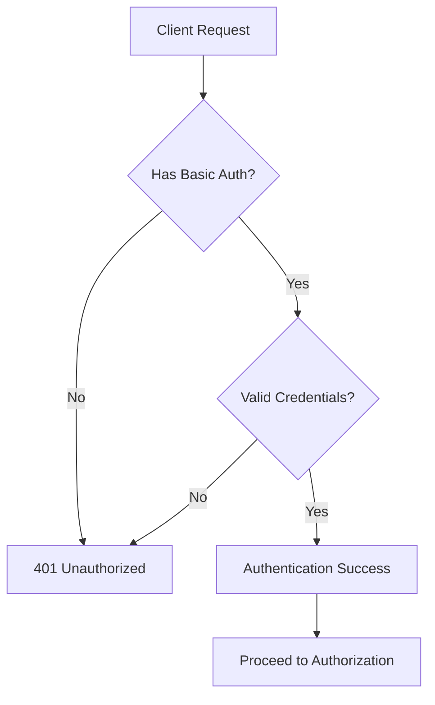
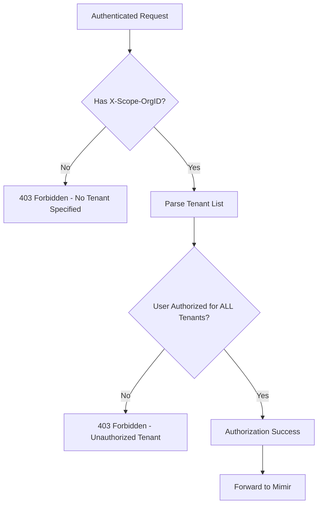

# Mimir Multi-Tenant Authentication & Authorization

## Overview

This document presents a comprehensive approach for implementing **secure multi-tenant access control** in Grafana Mimir deployments. Our solution addresses the critical challenge of providing fine-grained authentication and authorization in multi-tenant observability environments while maintaining operational simplicity and security best practices.

## Problem Statement

Multi-tenant Mimir deployments face several security and operational challenges:

- **Tenant Isolation**: Ensuring tenants can only access their own metrics and alerting rules
- **Scalable Access Control**: Managing authentication and authorization for potentially hundreds of users across multiple tenants
- **Operational Overhead**: Minimizing the complexity of user and tenant management
- **Security**: Protecting sensitive observability data from unauthorized access
- **Integration**: Working seamlessly with existing Mimir deployments and tooling

## Solution Overview

Our approach **leverages the Mimir Gateway's native NGINX capabilities** to implement a robust, scalable authentication and authorization layer that:

- ✅ **Integrates seamlessly** with existing Mimir deployments
- ✅ **Provides fine-grained tenant-level access control**
- ✅ **Supports dynamic configuration updates** without service disruption
- ✅ **Scales efficiently** for enterprise deployments
- ✅ **Maintains security best practices** with industry-standard authentication

**Architecture Assumption**: All external traffic to Mimir is routed through the Mimir Gateway. Internal cluster communication between Mimir components remains unfiltered for performance reasons.

## Architecture

### High-Level Components

```
┌─────────────────┐    ┌─────────────────────────────────────────┐    ┌─────────────────┐
│   External      │    │           Mimir Gateway                 │    │   Mimir Cluster │
│   Clients       │───▶│  ┌─────────────────────────────────────┐│───▶│                 │
│                 │    │  │   NGINX          Authentication &   ││    │  ┌───────────┐  │
│ • Grafana       │    │  │                  Authorization      ││    │  │ Queriers  │  │
│ • Prometheus    │    │  │ ┌─────────┐                         ││    │  │           │  │
│ • AlertManager  │    │  │ │ Basic   │     ┌─────────────────┐ ││    │  │ Ingesters │  │
│ • mimirtool     │    │  │ │ Auth    │     │ Tenant Access   │ ││    │  │           │  │
└─────────────────┘    │  │ └─────────┘     │ Control (Perl)  │ ││    │  │ Rulers    │  │
                       │  │ ┌─────────┐     └─────────────────┘ ││    │  └───────────┘  │
                       │  │ │ Config  │   ┌────────────────────┐││    └─────────────────┘
                       │  │ │ reloader│   │ Authorized Tenants │││
                       │  │ └─────────┘   │ Mapping            │││
                       │  │               └────────────────────┘││
                       │  └─────────────────────────────────────┘│
                       └─────────────────────────────────────────┘
```

### Component Responsibilities

| Component | Responsibility |
|-----------|----------------|
| **NGINX Basic Auth** | Validates user credentials using htpasswd format |
| **Config Reloader** | Monitors configuration changes and triggers NGINX reload |
| **Tenant Access Control** | Perl-based authorization logic matching users to allowed tenants |
| **Authorized Tenants Mapping** | File-based mapping of users to their permitted tenant list |

## Design Principles & Security Model

### Core Security Principles

Our security model follows the principle of **least privilege** and **defense in depth**:

1. **Deny by Default**: All requests are rejected unless explicitly authenticated and authorized
2. **Explicit Authorization**: Users must be explicitly granted access to specific tenants
3. **Multi-Tenant Isolation**: Cross-tenant access requires explicit permission for each tenant

### Authentication Flow



**Authentication Process:**
- Each request is authenticated by verifying the username and password provided in the `Authorization` HTTP header using **HTTP Basic Authentication**
- Credentials are validated against an htpasswd-format file containing user credentials
- If credentials are invalid or missing, the request is rejected with a `401 Unauthorized` status code
- If authentication succeeds, the request proceeds to the authorization phase

### Authorization Flow



**Authorization Process:**
- Authenticated users must be explicitly authorized to access requested tenant(s)
- Tenants are specified via the `X-Scope-OrgID` HTTP header as a pipe-separated list (e.g., `X-Scope-OrgID: tenant1|tenant2`)
- **All requested tenants must be in the user's authorized tenant list** for the request to succeed
- If any requested tenant is not authorized, the request is rejected with a `403 Forbidden` status code
- **Requests without tenant specification are rejected** to prevent accidental cross-tenant access

### Special Endpoints

Certain endpoints bypass authentication and authorization for operational reasons:
- `GET /`: Health check endpoint for load balancers and monitoring
- `GET /ready`: Readiness probe for Kubernetes deployments

### Design Rationale

**Why NGINX + Perl over alternatives?**
- **Performance**: NGINX handles high-throughput traffic efficiently
- **Integration**: Native integration with existing Mimir Gateway
- **Flexibility**: Perl scripting allows complex authorization logic
- **Reliability**: Battle-tested components with extensive documentation
- **Operational Simplicity**: Minimal additional infrastructure required

### Configuration files

- The authentication mechanism uses basic authentication where usernames and passwords are stored in a file following the htpasswd format.

Each line in the file represents a user, its password hash, and an optional comment, separated by colons.

For example:

```
admin:$apr1$igH6wO3k$hn40n92o/MfXc9ByWm1fG1:Administrator
foo:$apr1$hxodO6xP$EjQDOid6Lf1MsJ/lrVLFg0
bar:$apr1$zxwiSjko$G9sxj4aNDpHGJDBf.o7IL1
```

Note that this file format is specified by the NGINX [`ngx_http_auth_basic_module`](https://nginx.org/en/docs/http/ngx_http_auth_basic_module.html#auth_basic_user_file) module.

- The authorization mechanism is defined by mapping of each user to a list of tenants it can access wich is stored in a file, with the following format:

Each line in the file represents a user and the list of tenants it can access, separated by a space, and terminated by a semicolon `;`. The list of tenants is a pipe-separated list.

For example:

```
admin tenant1|tenant2|tenant3;
foo tenant1|tenant2;
bar tenant3;
```

Note that this file format is specified by the NGINX [`ngx_http_map_module`](https://nginx.org/en/docs/http/ngx_http_map_module.html#map) module, more about that later on.

## Implementation

I hope you liked the AI augmented previous sections, now let's get our hands dirty and implement the solution.
Here will describe how to implement the authentication and authorization mechanisms in the Mimir Gateway with examples along the way.

### 1. Authentication

Basic authentication is already configurable via the Mimir Gateway Helm chart ([`.mimir.gateway.nginx.basicAuth`](https://github.com/grafana/mimir/blob/c31a3475bc98f04c97da77c6ea1448a83d618f34/operations/helm/charts/mimir-distributed/values.yaml#L3743-L3756)).

In order to enable basic authentication in the Mimir Gateway we need 2 things:

- enable the setting in the Helm chart configuration
- create a Kubernetes secret containing the usernames and passwords for in the htpasswd format

To create the secret we can use the `htpasswd` command line tool to create a file containing the usernames and passwords in the htpasswd format.

e.g.

```sh
$ htpasswd -ci .htpasswd admin < adminpassword_file
Adding password for user admin
$ htpasswd -i .htpasswd admin < foopassword_file
Adding password for user foo
$ htpasswd -i .htpasswd admin < barpassword_file
Adding password for user bar
```

Then we create a Kubernetes secret from the file:

```yaml
$ kubectl create secret generic mimir-gateway-basic-auth-secret --dry-run=client -oyaml --from-file .htpasswd
apiVersion: v1
data:
  .htpasswd: YWRtaW46JGFwcjEkNEdxdVlFSTIkRThRUnc4czNTMHY2N2Z1UEJXcEhkMApmb286JGFwcjEkSlcySDh5SVYkUGFYNlVVUEZPWUIwbldZcTN6L1RHLgpiYXI6JGFwcjEkL3Y4R1AvRlQkMjNBYi5WTTVMSFlwUWVETnFnRXVuMAo=
kind: Secret
metadata:
  name: mimir-gateway-basic-auth-secret
```

To enable basic authentication in the Mimir Gateway we need to set the following values in the helm chart `values.yaml` file:

```yaml
cat > values.yaml <<EOF
mimir:
  gateway:
    nginx:
      basicAuth:
        enabled: true
        existingSecret: mimir-gateway-basic-auth-secret
EOF
```

After applying the secret and the new configuration by upgrading the Helm release, all requests going through the Mimir Gateway will require basic **authentication**. Note that updates made to the secret will not be picked up automatically, you need to restart the Mimir Gateway pods, more on that later on.

### 2. Authorization

Authorization does not work out of the box in the Mimir Gateway, in order to implement this functionality we need 2 things:

- create a Kubernetes secret containing the user to tenants mapping file and mount it in the Mimir Gateway pod
- add custom NGINX configuration to the Mimir Gateway to implement the authorization logic

To create the secret we first need to create a file containing the user to tenants mapping in the required format.

e.g.

```sh
cat <<EOF > user-tenant-mapping.txt
admin tenant1|tenant2|tenant3;
foo tenant1|tenant2;
bar tenant3;
EOF
```

Then we create a Kubernetes secret from the file:

```yaml
$ kubectl create secret generic mimir-gateway-authorized-tenants --dry-run=client -oyaml --from-file authorized_tenants.map
apiVersion: v1
data:
  authorized_tenants.map: YWRtaW4gdGVuYW50MXx0ZW5hbnQyfHRlbmFudDM7CmZvbyB0ZW5hbnQxfHRlbmFudDI7CmJhciB0ZW5hbnQzOwo=
kind: Secret
metadata:
  name: mimir-gateway-authorized-tenants
```

Then we need to mount this secret in the Mimir Gateway pod:

```yaml
mimir:
  gateway:
    extraVolumes:
    - name: mimir-gateway-authorized-tenants
      secret:
        secretName: mimir-gateway-authorized-tenants
    extraVolumeMounts:
    - name: mimir-gateway-authorized-tenants
      mountPath: /etc/nginx/authorized-tenants
      readOnly: true
```

For the core authorization logic I am using a **Perl** script and an NGINX `map` to load the user to tenants mapping. For this we need to use an NGINX image with the Perl module enabled, and to set the custom NGINX configuration via the Helm chart:

```nginx
mimir:
  gateway:
    nginx:
      config:
        # Enable perl module in nginx for tenant access control
        # This abuses the multiline string to inject multiple top-level config options.
        errorLogLevel: |-
          error;
          load_module modules/ngx_http_perl_module.so
        httpSnippet: |
          # Match basic auth user to its configured tenant IDs.
          # The $authorized_tenants variable will contain a pipe-separated list of tenant IDs the user is allowed to access.
          map $remote_user $authorized_tenants {
              include /etc/nginx/authorized-tenants/authorized_tenants.map;
          }

          # Restrict access to tenants based on X-Scope-OrgID header, using a perl script.
          # Access is granted if all tenants listed in X-Scope-OrgID header are contained in the $authorized_tenants variable.
          # If there is no X-Scope-OrgID header, the request is denied.
          # If $authorized_tenants is empty, the request is denied.
          # Both $authorized_tenants and X-Scope-OrgID can contain multiple pipe-separated values (e.g. "tenant1|tenant2").
          # https://grafana.com/docs/mimir/latest/configure/about-tenant-ids/
          # $tenant_access_authorized is set to 1 if access is allowed, 0 if access is denied
          perl_set $tenant_access_authorized '
              sub {
                my $r = shift;

                # url / and /ready are special cases for health checks and internal requests
                # otherwise the requests will be blocked with 403
                return 1 if $r->variable("uri") eq "/";
                return 1 if $r->variable("uri") eq "/ready";

                # Split the pipe-separated strings into arrays
                my @authorized_tenants_array = split /\|/, $r->variable("authorized_tenants");
                my @requested_ids = split /\|/, $r->variable("http_x_scope_orgid");

                # Deny access if no tenants are requested
                return 0 if !@requested_ids;

                # Create a hash for for lookups
                my %authorized_tenants_hash = map { $_ => 1 } @authorized_tenants_array;

                # Check if all requested tenants are in the authorized tenants
                foreach my $element (@requested_ids) {
                    unless (exists $authorized_tenants_hash{$element}) {
                        # Unauthorized tenant id
                        return 0;
                    }
                }

                # All tenant ids are authorized
                return 1;
              }
          ';
        serverSnippet: |
          if ($tenant_access_authorized = 0) {
              return 403 'Forbidden';
          }
      image:
        # Use an NGINX image with Perl module enabled
        registry: docker.io
        repository: nginxinc/nginx-unprivileged
        tag: 1.28-alpine-perl
```

After applying the secret and the new configuration by upgrading the Helm release, all requests going through the Mimir Gateway will require **authorization**. Note that updates made to the secret will not be picked up automatically, you need to restart the Mimir Gateway pods, more on that later on.

### 3. Automatic config reload

Until now we have implemented authentication and authorization, but changes made to the secrets will not be picked up automatically. In order to implement automatic config reload we can leveraged initialization mechanism and `inotifyd` tool, provided in the `nginxinc/nginx-unprivileged` image to watch for changes in the secrets and reload NGINX when a change is detected.

We need 2 scripts for this to work:

- `config-watcher.sh`: this script will start `inotifyd` to watch for changes in the secrets and reload NGINX when a change is detected

```sh
#!/bin/sh

inotifyd /usr/bin/nginx-reload.sh \
  /etc/nginx/authorized-tenants/authorized_tenants.map:c \
  /etc/nginx/secrets/.htpasswd:c &
```

- `nginx-reload.sh`: this script will reload NGINX (inotifyd requires a program to execute on event)

```sh
#!/bin/sh

nginx -s reload
```

Then we need to create a Kubernetes ConfigMap containing them:

```yaml
$ kubectl create configmap mimir-gateway-reload --dry-run=client -oyaml --from-file=config-watcher.sh --from-file=nginx-reload.sh
apiVersion: v1
data:
  config-watcher.sh: |
    #!/bin/sh

    inotifyd /usr/bin/nginx-reload.sh \
      /etc/nginx/authorized-tenants/authorized_tenants.map:c \
      /etc/nginx/secrets/.htpasswd:c &
  nginx-reload.sh: |
    #!/bin/sh

    nginx -s reload
kind: ConfigMap
metadata:
  name: mimir-gateway-reload
```

Now we need to mount this ConfigMap in the Mimir Gateway pod and run the `config-watcher.sh` script during initialization:

```yaml
mimir:
  gateway:
    extraVolumes:
    - name: mimir-gateway-reload
      configMap:
        name: mimir-gateway-reload
        defaultMode: 0755
    extraVolumeMounts:
    # subPath is required to avoid symlinks
    # which are not executed by the entrypoint script
    - name: mimir-gateway-reload
      mountPath: /docker-entrypoint.d/config-watcher.sh
      subPath: config-watcher.sh
    - name: mimir-gateway-reload
      mountPath: /usr/bin/nginx-reload.sh
      subPath: nginx-reload.sh
```

After applying the ConfigMap and the new configuration by upgrading the Helm release, changes made to the secrets will be picked up automatically and NGINX will be reloaded. The delay between making a change and NGINX reloading is usually a few seconds.

## Testing

We can test the authentication and authorization by making requests to the Mimir Gateway using different users and tenants.

- First we need to port-forward the Mimir Gateway service to localhost:

```sh
kubectl -n mimir port-forward svc/mimir-gateway 8080
```

- Then we can make requests using [`mimirtool`](https://grafana.com/docs/mimir/latest/manage/tools/mimirtool/):
  - `--user` is the basic auth username
  - `--key` is the basic auth password
  - `--id` is the tenant ID to access

```sh
$ mimirtool rules list --address=http://127.0.0.1:8080 --user admin --password strongpassword --id tenant1
Namespace                                                | Rule Group
somenamespace                                            | somegroup
... (remaining output truncated) ...
```

- Or using `curl`:

```sh
$ curl -i -u admin:strongpassword -H "X-Scope-OrgID: tenant1|tenant2" http://localhost:8080/prometheus/api/v1/query --data-urlencode "query=ALERTS"
HTTP/1.1 200 OK
Server: nginx/1.28.0
Date: Tue, 02 Sep 2025 16:54:39 GMT
Content-Type: application/json
Transfer-Encoding: chunked
Connection: keep-alive
Server-Timing: querier_wall_time;dur=2.616544, response_time;dur=4.157267, bytes_processed;val=1018, samples_processed;val=20
Vary: Accept-Encoding

{
  "status": "success",
  "data": {
    "resultType": "vector",
    "result": [
      {
        "metric": {
          "__name__": "ALERTS",
... (remaining output truncated) ...
```

Try different combinations of users and tenants to verify that the authorization works as expected.

## Caveats

- All access data (authentication and authorization files) are loaded in memory by NGINX, this might not scale well with a large number of users and tenants.
- The configuration reload script is "just" running in the background, if it crashes for some reason it will not be restarted. A more robust solution would be to use a sidecar container with a process manager to ensure that the script is always running like [s6-overlay](https://github.com/just-containers/s6-overlay) or  [config-reloader-sidecar](https://github.com/Pluies/config-reloader-sidecar).
- The NGINX load_module directive for perl is injected in a bit of a hacky way using the `errorLogLevel` setting, this might break in future versions of the Mimir Gateway Helm chart if the chart is changed to validate the value of this setting.

## Conclusion

In this document I have described a possible approach to provide authentication and authorization for a multi-tenant Mimir setup leveraging the Mimir Gateway's NGINX capabilities. This approach provides a flexible and scalable way to manage access to multiple tenants in Mimir, while ensuring that only authorized users can access the data they are allowed to see.

Et voilà! doing a bit of Perl and NGINX was fun after all :)
